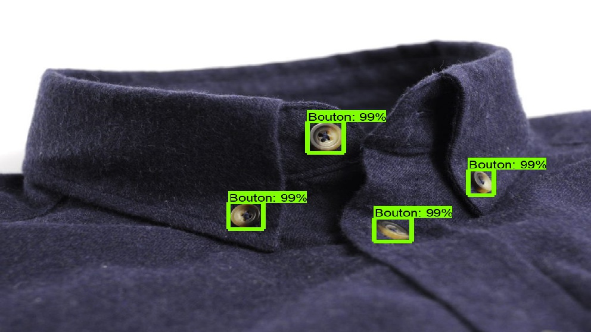
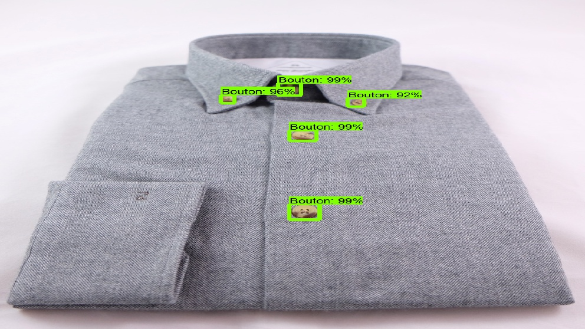
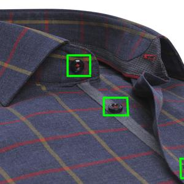
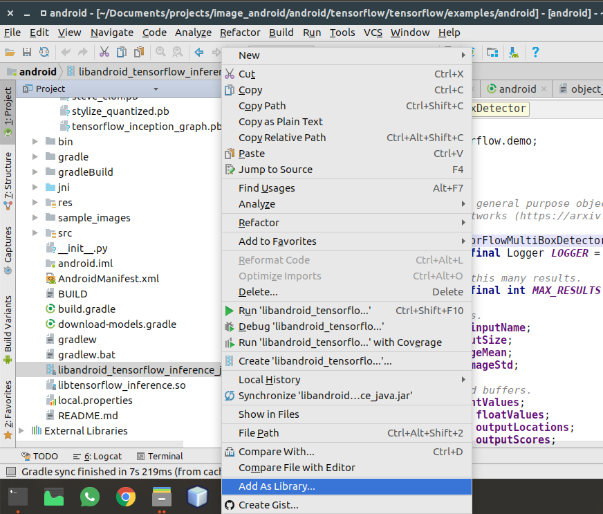
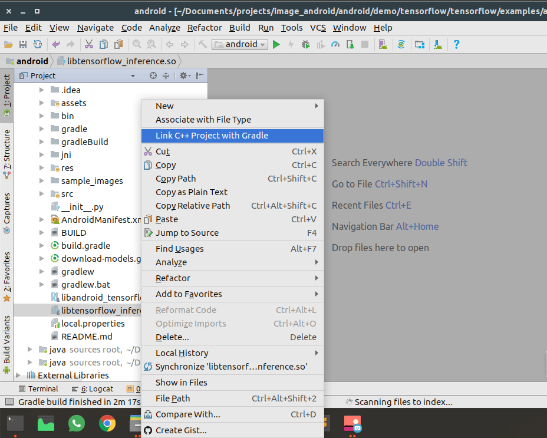
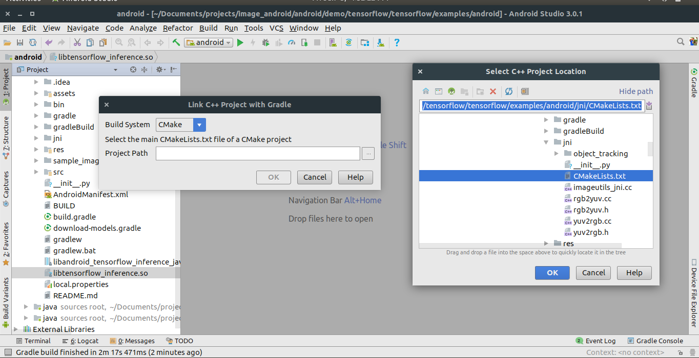
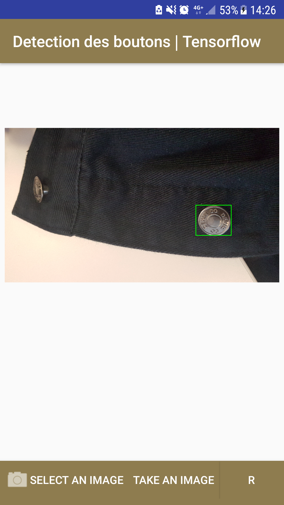
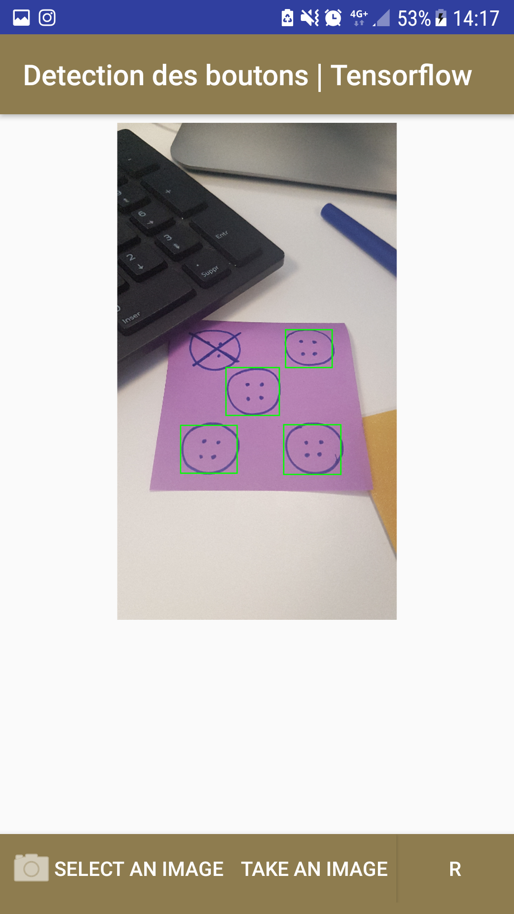
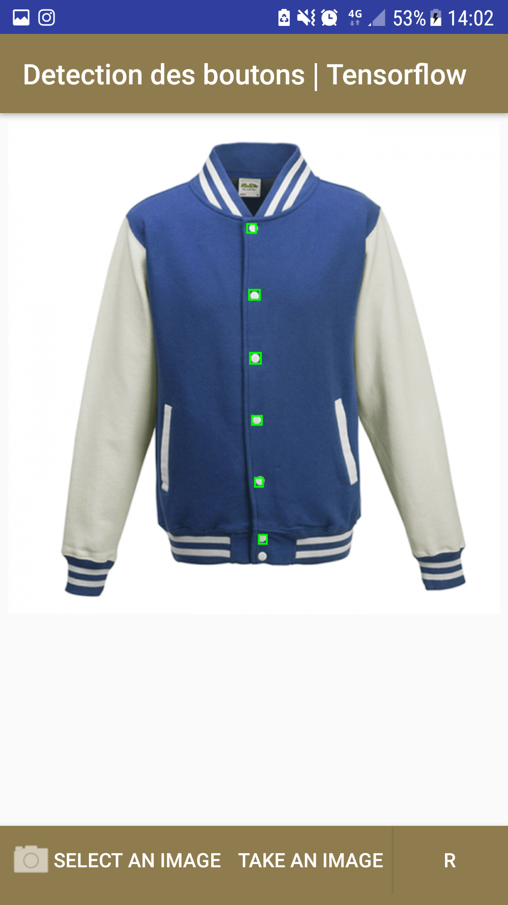

    

-----------------

| **`Documentation`** |
|-----------------|
|  |

# TensorFlow Android Camera Demo

This folder contains an example application utilizing TensorFlow for Android
devices.

## Description

The demos in this folder are designed to give straightforward samples of using
TensorFlow in mobile applications.

Inference is done using the [TensorFlow Android Inference
Interface](../../../tensorflow/contrib/android), which may be built separately
if you want a standalone library to drop into your existing application. Object
tracking and efficient YUV -> RGB conversion are handled by
`libtensorflow_demo.so`.

A device running Android 5.0 (API 21) or higher is required to run the demo due
to the use of the camera2 API, although the native libraries themselves can run
on API >= 14 devices.

## Current samples:

1. [Detection des boutons | Tensorflow : enabled](https://github.com/tensorflow/tensorflow/blob/master/tensorflow/examples/android/src/org/tensorflow/demo/ClassifierActivity.java):
        Demonstrates an Faster-RCNN model trained using the
        [Tensorflow Object Detection API](https://gitlab-lyon.sqli.com/ebmourabit/visual-recognition-server-control-ionic-back) to classify camera uploded or taken images, with displaying the recognition results.

2. [TF Classify : disabled](https://github.com/tensorflow/tensorflow/blob/master/tensorflow/examples/android/src/org/tensorflow/demo/ClassifierActivity.java):
        Uses the [Google Inception](https://arxiv.org/abs/1409.4842)
        model to classify camera frames in real-time, displaying the top results
        in an overlay on the camera image.
3. [TF Detect : disabled](https://github.com/tensorflow/tensorflow/blob/master/tensorflow/examples/android/src/org/tensorflow/demo/DetectorActivity.java):
        Demonstrates an SSD-Mobilenet model trained using the
        [Tensorflow Object Detection API](https://github.com/tensorflow/models/tree/master/research/object_detection/)
        introduced in [Speed/accuracy trade-offs for modern convolutional object detectors](https://arxiv.org/abs/1611.10012) to
        localize and track objects (from 80 categories) in the camera preview
        in real-time.
4. [TF Stylize : disabled](https://github.com/tensorflow/tensorflow/blob/master/tensorflow/examples/android/src/org/tensorflow/demo/StylizeActivity.java):
        Uses a model based on [A Learned Representation For Artistic Style](https://arxiv.org/abs/1610.07629) to restyle the camera preview
        image to that of a number of different artists.
5.  [TF Speech : disabled](https://github.com/tensorflow/tensorflow/blob/master/tensorflow/examples/android/src/org/tensorflow/demo/SpeechActivity.java):
    Runs a simple speech recognition model built by the [audio trainin tutorial](https://www.tensorflow.org/versions/master/tutorials/audio_recognition). Listens
    for a small set of words, and highlights them in the UI when they are
    recognized.
        

**Examples of the Upload and Take Images detection (Buttons Detection Case) :**  
       

## Prebuilt Components:

If you just want the fastest path to trying the demo, you may download the
nightly build
[here](https://ci.tensorflow.org/view/Nightly/job/nightly-android/). Expand the
"View" and then the "out" folders under "Last Successful Artifacts" to find
tensorflow_demo.apk.

Also available are precompiled native libraries, and a jcenter package that you
may simply drop into your own applications. See
[tensorflow/contrib/android/README.md](../../../tensorflow/contrib/android/README.md)
for more details.

## Running the Demo

### 1 - Explanations

Few important pointers that we should know:

    The core of the TensorFlow is written in c++.
    In order to build for Android, we have to use JNI(Java Native Interface) to call 
    the c++ functions like loadModel, getPredictions, etc.
    We will have a .so(shared object) file which is a c++ compiled file and a jar file
    which will consist of JAVA API that will be calling the native c++. And then, 
    we will be calling the JAVA API to get things done easily.
    So, we need the jar(Java API) and a .so(c++ compiled) file.
    We must have the pre-trained model file and a label file for the classification

### 2 - Procedures:

   1- First clone the tensorflow android repo from this link and store in your project folder:

    git clone –recurse-submodules <THIS-GITHUB-REPO>`

   2- Get installed Android Studio

   3- Create a **temp_folder** and create a **button_detect_label.txt** and type (??? important at the head of the file, 
      because we have just one class for buttons example) :
      
    ???
    Button

   4- Copy the **frozen_inference_graph.pb** generated by [Tensorflow Object Detection API](https://gitlab-lyon.sqli.com/ebmourabit/visual-recognition-server-control-ionic-back)
      and move it to the **temp_folder** and rename it as **faster_rcnn_buttons_graph.pb**
 
   5- You have collected all your necessary resource files for your android implementation.Now open your Android Studio 
      and Click open the existing project and navigate to : **./tensorflow/examples/android** and open it.You have 
      the pre-built Tensorflow demo modules applied in the android application.
      
   6-  Move your **faster_rcnn_buttons_graph.pb(model file)** and **button_detect_label.txt(label file)** to assets folder under your app project.
   
   7- Click the **libandroid_tensorflow_inference_java.jar** and choose **“Add As Library”**
   
   
      
   8- Click the **libtensorflow_inference.so** and choose **Link C++ Project with Gradle**. Then a CMake dialog box opens give 
      the path of the **CMake.txt** .Refer the below image
   
   
   
      
   9- Give your model path and label path to your project, if you have changed there names .
      Go to ***src>UploadActivity.java*** in your project and change the path as if in the image below
      
   10- Click the Run button to generate your application.

### 3 - Results

  

Once the app is installed it can be started via the "***Detection des boutons | Tensorflow***" icon, which have the orange TensorFlow logo as
their icon.

